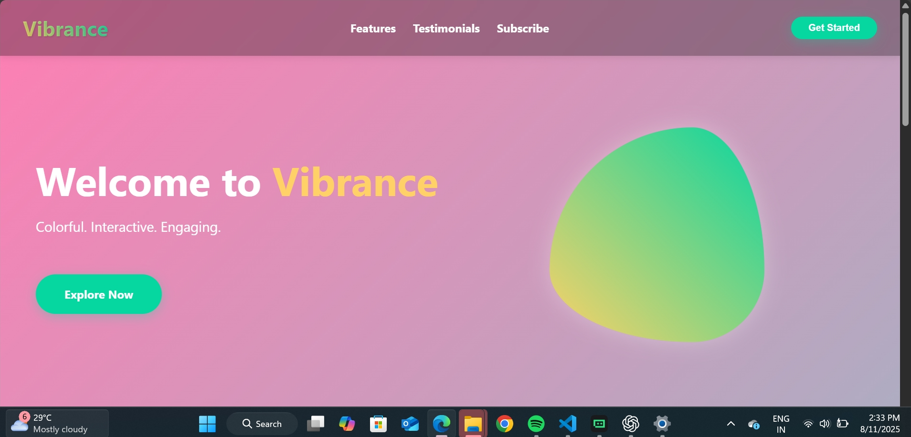
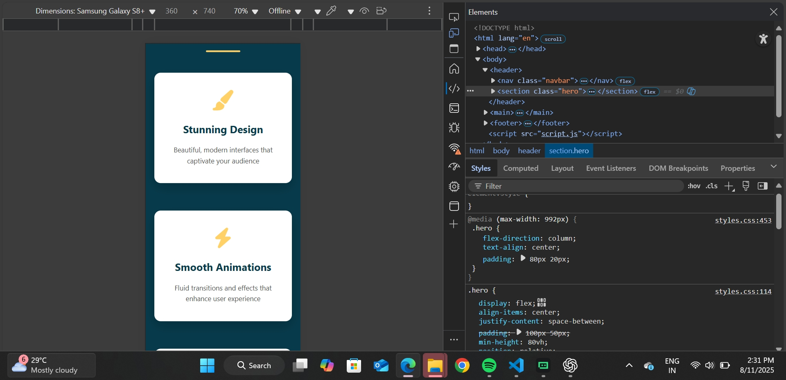

# 🎨 Vibrance Landing Page

A **colorful**, **interactive**, and **fully responsive** landing page built with **HTML**, **CSS**, and **JavaScript**.
Vibrance delivers a visually striking, mobile-friendly design perfect for startups, portfolios, and product launches.

---

## 📖 Table of Contents

* [Features](#-features)
* [Technologies Used](#-technologies-used)
* [Project Structure](#-project-structure)
* [Getting Started](#-getting-started)
* [Customization](#-customization)
* [Screenshots](#-screenshots)
* [License](#-license)

---

## ✨ Features

* **Responsive Navigation** with hamburger menu for mobile devices.
* **Hero Section** with engaging headline and call-to-action button.
* **Features Section** with icons and descriptions.
* **Testimonials Section** to highlight customer feedback.
* **Newsletter Subscription Form** with email input.
* Smooth animations and colorful gradients.
* Mobile-first responsive design.

---

## 🛠 Technologies Used

* **HTML5** — semantic and accessible structure.
* **CSS3** — Flexbox, gradients, animations, responsive layouts.
* **JavaScript (Vanilla)** — interactivity and mobile menu toggle.
  

---

## 📂 Project Structure

```
.
├── index.html       # Main HTML file
├── styles.css       # Styles and animations
├── script.js        # JavaScript interactivity

```

---

## 🚀 Getting Started

### 1️⃣ Clone the Repository

```bash
git clone https://github.com/yourusername/vibrance-landing-page.git
cd vibrance-landing-page
```

### 2️⃣ Open in Browser

Open the `index.html` file directly in your web browser:

```bash
open index.html
```

Or drag & drop into a browser window.

> For live development with auto-refresh, install [Live Server](https://marketplace.visualstudio.com/items?itemName=ritwickdey.LiveServer) in VS Code.

---

## 🎨 Customization

* **Colors & Gradients** → edit in `styles.css`.
* **Text & Content** → edit in `index.html`.
* **Animations** → adjust in `styles.css` and `script.js`.
* **Icons** → update via [Font Awesome](https://fontawesome.com/).

---

## 📸 Screenshots

**Desktop View**


**Mobile View**


---

## 📄 License

This project is licensed under the **MIT License** — you can freely use, modify, and distribute it.

---


